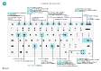

# Snelle toetsenbordnaslag - alleen pc

#### Algemeen

|Selecteer deze toetsen|Actie|  
|-|-|
|<kbd>Alt</kbd>|Toon toegangstoetsen om door de actiebalk of het navigatiemenu te navigeren|
|<kbd>Alt</kbd>+<kbd>F2</kbd>|Het deelvenster Feitenblok weergeven of verbergen|
|<kbd>Alt</kbd>+<kbd>N</kbd>|Een nieuwe record maken|
|<kbd>Alt</kbd>+<kbd>Shift</kbd>+<kbd>N</kbd>|Een nieuw gemaakte record sluiten en een nieuwe maken|
|<kbd>Alt</kbd>+<kbd>O</kbd>|Een nieuwe notitie toevoegen voor de geselecteerde record|
|<kbd>Alt</kbd>+<kbd>Q</kbd>|**Vertel me** openen|
|<kbd>Ctrl</kbd>+<kbd>Alt</kbd>+<kbd>Q</kbd>|**Posten zoeken** openen|
|<kbd>Alt</kbd>+<kbd>Omhoog</kbd>|Knopinfo openen of validatiefout|
|<kbd>Alt</kbd>+<kbd>Pijl omlaag</kbd>|Een vervolgkeuzelijst of opzoekactie openen|
|<kbd>Ctrl</kbd>+<kbd>Alt</kbd><kbd>Pijl-omlaag</kbd>|Open de kaart- of lijstpagina van een gerelateerde record, gefilterd op de waarde in het opzoek- of AssistEdit-veld|
|<kbd>Alt</kbd>+<kbd>T</kbd>|De pagina **Mijn instellingen** openen|
|<kbd>Alt</kbd>+<kbd>Shift</kbd>+<kbd>W</kbd>|De huidige kaart of het huidige document openen in een nieuw venster|
|<kbd>Ctrl</kbd>+<kbd>Insert</kbd>|Een nieuwe regel in een document invoegen|
|<kbd>Ctrl</kbd>-<kbd>Delete</kbd>|De regel verwijderen uit een document, een dagboek of een werkblad|
|<kbd>Ctrl</kbd>+<kbd>Shift</kbd>+<kbd>F12</kbd>|Het gedeelte met regelitems maximaliseren op een documentpagina|
|<kbd>Ctrl</kbd>+<kbd>F1</kbd>|Het helpvenster of een helpartikel openen|
|<kbd>Ctrl</kbd>+Klikken|Navigeren bij het personaliseren en aanpassen|
|<kbd>Ctrl</kbd>+<kbd>O</kbd>|Overstappen van bedrijf of omgeving|
|<kbd>Shift</kbd>+<kbd>F12</kbd>|Open de rollenverkenner, een functieoverzicht|
|<kbd>F5</kbd>/<kbd>Ctrl</kbd>+<kbd>F5</kbd>|Pagina vernieuwen/opnieuw laden|
|<kbd>Tab</kbd>/<kbd>Shift</kbd>+<kbd>Tab</kbd>|Focus verplaatsen naar volgende/vorige element|
|<kbd>F6</kbd>/<kbd>Shift</kbd>+<kbd>F6</kbd>|Naar het volgende sneltabblad/onderdeel gaan|

#### Navigeren en rijen selecteren

|Selecteer deze toetsen|Actie|
|-|-|
|<kbd>Home/End|Naar het eerste/laatste veld gaan|
|<kbd>Ctrl</kbd>+<kbd>Home</kbd>/<kbd>End</kbd>|Naar de eerste/laatste rij gaan|
|<kbd>Ctrl</kbd>+<kbd>Omhoog</kbd>/<kbd>Omlaag</kbd>|Navigeren zonder de selectie te verliezen|
|<kbd>Ctrl</kbd>+<kbd>A</kbd>|Alles selecteren|
|<kbd>Ctrl</kbd>+<kbd>Spatiebalk</kbd>|Selectie in-/uitschakelen|
|<kbd>Ctrl</kbd>/<kbd>Shift</kbd>+Klikken|De rij(en) toevoegen aan de selectie|
|<kbd>Shift</kbd>+<kbd>Omhoog</kbd>/<kbd>Omlaag</kbd>|Rij toevoegen boven/onder selectie|
|<kbd>Shift</kbd>+<kbd>Page Up</kbd>/<kbd>Omlaag</kbd>|Zichtbare rijen boven/onder selecteren|
|<kbd>Ctrl</kbd>+<kbd>Enter</kbd>|Focus uit de lijst verplaatsen|

#### Kopiëren en plakken

|Selecteer deze toetsen|Actie|
|-|-|
|<kbd>Ctrl</kbd>+<kbd>C</kbd>/<kbd>V</kbd>|Rijen kopiëren/plakken|
|<kbd>F8</kbd>|Veld erboven naar huidige rij kopiëren|

#### Zoeken, filteren en sorteren

|Selecteer deze toetsen|Actie|
|-|-|
|<kbd>Alt</kbd>+<kbd>F7</kbd>|Kolom sorteren in oplopende of aflopende volgorde|
|<kbd>F3</kbd>|Zoeken in-/uitschakelen|
|<kbd>Shift</kbd>+<kbd>F3</kbd>|Filterdeelvenster in-/uitschakelen; focus op veldfilters|
|<kbd>Alt</kbd>+<kbd>F3</kbd>|Filteren op geselecteerde celwaarde|
|<kbd>Shift</kbd>+<kbd>Alt</kbd>+<kbd>F3</kbd>|Filter op een geselecteerd veld toevoegen|
|<kbd>Ctrl</kbd>+<kbd>Alt</kbd>+<kbd>Shift</kbd>+<kbd>F3</kbd>|Filters opnieuw instellen|

#### Snelinvoer

|Selecteer deze toetsen|Actie|
|-|-|
|<kbd>Ctrl</kbd>+<kbd>Shift</kbd>+<kbd>Enter</kbd>|Naar volgende snelinvoerveld buiten een lijst gaan|
|<kbd>Enter</kbd>/<kbd>Shift</kbd>+<kbd>Enter</kbd>|Naar volgende/vorige snelinvoerveld gaan|

##### Rapportvoorbeeld

|Selecteer deze toetsen|Actie|
|-|-|
|<kbd>Ctrl</kbd>+<kbd>Home</kbd>/<kbd>End</kbd>|Naar de eerste/laatste pagina gaan|

#### Numeriek toetsenbord

|Selecteer deze toetsen|Actie|  
|-|-|
|<kbd>Alt</kbd>+<kbd>Decimaalteken</kbd>|Wissel de uitvoer van de decimale scheidingstoets op het numerieke toetsenbord|

> [!TIP]
> Kies de volgende afbeelding voor een grafische, afdrukbare weergave en download het PDF-bestand.
>
> 

[!INCLUDE[footer-include](includes/footer-banner.md)]
