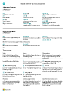

# Werken met [!INCLUDE[prod_short](includes/prod_short.md)]

Terwijl u aan het werk bent in [!INCLUDE [prod_short](includes/prod_short.md)], communiceert u op verschillende manieren met gegevens. U kunt bijvoorbeeld records maken, gegevens invoeren, gegevens sorteren en filteren, notities schrijven en gegevens naar andere toepassingen exporteren.

Er zijn veel manieren om het uiterlijk van pagina's aan te passen: 

* Het wijzigen van de grootte en positie van een pagina
* De breedte vergroten van kolommen en de hoogte vergroten van kolomkoppen
* Wijzig de manier waarop u gegevens in kolommen sorteert. 

Als u de horizontale schuifbalk wilt gebruiken om alle kolommen op een lijstpagina of documentregels weer te geven, is er een verticaal bevroren paneel is om te voorkomen dat sommige kolommen verschuiven.

[!INCLUDE [about-ui-learn](includes/about-ui-learn.md)]

## Tips en trucs

> [!TIP]
> Voor een printvriendelijk overzicht van de meest gebruikte functies kiest u de volgende afbeelding en downloadt u het PDF-bestand.
>
> 

## Koppelingen voor meer informatie

In de volgende tabel wordt een gedeelte van de algemene functionaliteit weergegeven met koppelingen naar artikelen waarin deze worden beschreven.

> [!NOTE]
> Naast de algemene functies die in dit gedeelte worden beschreven, kunt u andere functies gebruiken die meer bedrijfsgerelateerd zijn. Ga voor meer informatie naar [Algemene bedrijfsfunctionaliteit](ui-across-business-areas.md).

| Tot  | Ga naar |
| --- | --- |
|Een bepaalde pagina, rapport, actie, Help-artikel of partnerextensie zoeken. |[Pagina's en informatie zoeken met Vertel me](ui-search.md) |
|Een overzicht krijgen van pagina's voor uw rol en voor andere rollen en naar pagina's gaan.|[Pagina's zoeken met de Rolverkenner](ui-role-explorer.md)|
|Gegevens in weergaven, rapporten of functies filteren door speciale symbolen en tekens te gebruiken. |[Lijsten sorteren, doorzoeken en filteren](ui-enter-criteria-filters.md) |
|De vele algemene functies leren waarmee u snel en gemakkelijk gegevens kunt invoeren.|[Gegevens invoeren](ui-enter-data.md)|
|Leren hoe u snel gegevens kopieert en plakt en sneltoetsen gebruikt.|[Veelgestelde vragen over kopiëren en plakken](faq-copy-paste.yml)|
|Gegevens in specifieke datumbereiken gebruiken of verwerken. |[Werken met agendadatums en -tijden](ui-enter-date-ranges.md) |
|Identificeer de velden die u moet invullen. |[Verplichte velden detecteren](ui-mandatory-fields.md) |
|Begrijp de effecten van uw landinstelling. Leer hoe u de taal- en landinstellingen kunt wijzigen.|[Taal en landinstellingen wijzigen](about-locale-language.md)|
|Leren hoe u werkt met Excel vanuit praktisch overal in [!INCLUDE[prod_short](includes/prod_short.md)]|[Weergeven en bewerken in Excel](across-work-with-excel.md)|
|Bestanden toevoegen, koppelingen toevoegen of notities schrijven op kaarten en documenten.|[Bijlagen, koppelingen en notities op kaarten en in documenten beheren](ui-how-add-link-to-record.md)|
|Basisinstellingen wijzigen zoals bedrijf, werkdatum en rolcentrum. |[Basisinstellingen wijzigen](ui-change-basic-settings.md) |
|Ontvang meldingen over bepaalde gebeurtenissen of statuswijzigingen. Bijvoorbeeld wanneer u op het punt staat een klant te factureren die een achterstallig saldo heeft.|[Berichten beheren](ui-smart-notifications.md)|
|Wijzig welke acties en velden waar beschikbaar zijn volgens uw voorkeuren.|[Uw werkruimte personaliseren](ui-personalization-user.md) |
|Rapporten definiëren, afdrukken, opslaan of er een voorbeeld van bekijken en batchverwerkingen instellen en uitvoeren.|[Werken met rapporten, batchverwerkingen en XMLports](ui-work-report.md)|
|Beheer de inhoud en opmaak van rapporten en documenten. Geef op welke veldgegevens u wilt opnemen en hoe deze worden weergegeven. Kies bijvoorbeeld een tekststijl, voeg afbeeldingen toe en meer.|[Rapport- en documentlay-outs beheren](ui-manage-report-layouts.md) |
|Leer meer over functies die ervoor zorgen dat [!INCLUDE[prod_short](includes/prod_short.md)] toegankelijk is voor mensen met een beperking.|[Toegankelijkheid en sneltoetsen](ui-accessibility.md)|

## Werken in Business Central

Hier volgt een korte video van hoe u werkt in [!INCLUDE[prod_short](includes/prod_short.md)].

> [!VIDEO https://www.youtube.com/embed/zqz03iMihx0]

## Een desktopbrowser kiezen

[!INCLUDE[prod_short](includes/prod_short.md)] ondersteunt meerdere browsers en elke browser biedt verschillende functies. De browser speelt een belangrijke rol in het reactievermogen en de soepelheid van de gebruikersinterface. Bekijk de lijst met ondersteunde, aanbevolen browsers voor [Business Central online](./product-requirements.md) en browsers voor [Business Central on-premises](/dynamics365/business-central/dev-itpro/deployment/system-requirement-business-central-v15).

- Vermijd waar mogelijk oudere browsers zoals Internet Explorer. Schakel in plaats daarvan over naar een van onze aanbevolen moderne browsers, zoals de [nieuwe Microsoft Edge](https://www.microsoft.com/edge/).  

    > [!NOTE]
    > Internet Explorer wordt niet langer ondersteund. Ga voor meer informatie naar [Microsoft Edge-documentatie](https://support.microsoft.com/hub/4337664/microsoft-edge-help).
- Houd uw browser up-to-date met de nieuwste versie.

## Actiebalken

Binnen [!INCLUDE [prod_short](includes/prod_short.md)] doet u het meeste van uw werk in een lijst, een document of een kaart. Alle pagina's hebben een balk met acties die voor hen relevant zijn. De acties zijn vrijwel hetzelfde voor de individuele kaart of document en de lijst met entiteiten. Op deze manier kunt u een individuele verkooporder beheren op de pagina **Verkooporder** en in de lijst **Verkooporders**, inclusief het boeken en factureren ervan.  

De manier waarop u een pagina opent en de context van wat u doet, zijn van invloed op de beschikbaarheid van acties. Acties kunnen er anders uitzien, niet beschikbaar zijn of zelfs niet aanwezig zijn. Niet alle acties zijn relevant of worden ondersteund voor alle processen. Bovendien vereisen sommige acties dat u een selectie maakt. Als een actie niet relevant of ondersteund is, maken we deze niet beschikbaar. Dat doen we om duidelijk te maken wat u met uw selecties kunt doen.

Specifiek voor lijstpagina's, de lijstpagina die u opent vanaf de startpagina en de pagina die wordt geopend wanneer u het pictogram  gebruikt, om ernaar te zoeken zijn niet identiek.  

Wanneer u zoekt naar een lijstpagina en deze opent, zoals de lijst **Verkooporders**, is deze in de weergavemodus. De acties voor het bewerken, bekijken of verwijderen van een afzonderlijke entiteit, zoals een verkooporder, worden weergegeven wanneer u de actie **Beheren** kiest.  

> [!TIP]
> Als u weet dat u de acties op het tweede niveau van de actiebalk vaak zult gebruiken, kiest u het pictogram :::image type="icon" source="media/pin.png" border="false"::: om de actiebalk vast te zetten en de acties onder de verschillende menu's direct vindbaar te maken.
>
> Om het tweede niveau van de actiebalk weer te verbergen kiest u het pictogram :::image type="icon" source="media/unpin.png" border="false":::.

Wanneer u dezelfde lijstpagina opent vanaf uw startpagina, is de actie **Beheren** niet beschikbaar. Kies in plaats daarvan om een individuele verkooporder te openen het veld **Aantal**. In deze weergave kunt u de actiebalk niet vastzetten.  

## Zie ook

[Voorbereid zijn om zaken te doen](ui-get-ready-business.md)  
[Business Central instellen](setup.md)  
[Algemene bedrijfsfunctionaliteit](ui-across-business-areas.md)  
[Prestatietips voor zakelijke gebruikers](/dynamics365/business-central/dev-itpro/performance/performance-users?toc=/dynamics365/business-central/toc.json)

## [!INCLUDE[prod_short](includes/free_trial_md.md)]

[!INCLUDE[footer-include](includes/footer-banner.md)]
